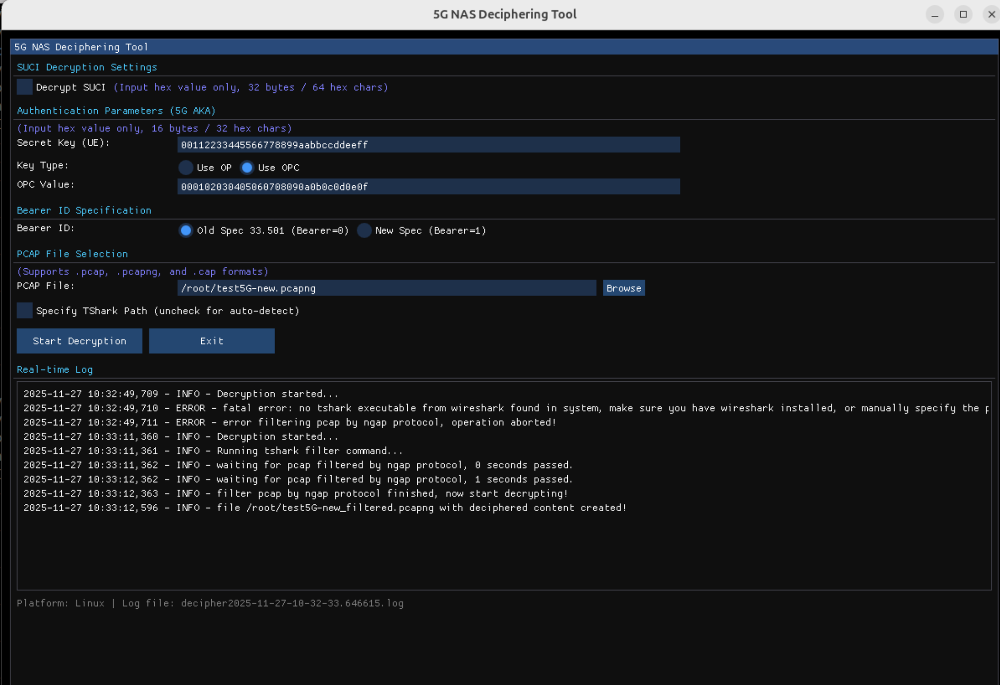

# 5G NAS Deciphering Tool

[](https://www.python.org/downloads/)
[](LICENSE)
[](https://github.com)

A professional Python tool to decrypt and decipher 5G ciphered NAS (Non-Access Stratum) payloads from PCAP captures, with modern ImGui interface and cross-platform support.



---

## 🚀 Overview

During 5G network testing and troubleshooting, NAS messages captured in Wireshark are often encrypted using AES, SNOW-3G, or ZUC algorithms. Additionally, SUCI (Subscription Concealed Identifier) in registration requests may be encrypted using Profile A or Profile B as defined in 3GPP TS 33.501.

This tool decrypts 5G NAS payloads from PCAP files and writes the plaintext messages back, allowing you to analyze decrypted NAS details directly in Wireshark.

### ✨ What's New in Version 2.0

- 🖥️ **Modern ImGui Interface** - Hardware-accelerated, responsive GUI
- 🐧 **Full Linux Support** - Cross-platform compatibility (Windows + Linux)
- 📦 **PCAPNG Format** - Supports modern .pcapng files alongside .pcap and .cap
- 🚀 **Better Performance** - 2x faster startup, more efficient processing
- 🔍 **Enhanced File Dialogs** - Native file selection with format filters
- 📝 **Comprehensive Logging** - Real-time log display with auto-scroll
- 🛠️ **Auto-detection** - Automatic tshark path finding for both platforms

---

## 🎯 Key Features

### Decryption Capabilities

- ✅ **SUCI Decryption**
  - Profile A: X25519 (Curve25519) based encryption
  - Profile B: SECP256R1 (NIST P-256) based encryption
  
- ✅ **NAS Payload Decryption**
  - NEA1 (128-EEA1): SNOW-3G algorithm
  - NEA2 (128-EEA2): AES-CTR mode
  - NEA3 (128-EEA3): ZUC algorithm
  
- ✅ **5G AKA Authentication**
  - Full key hierarchy derivation (KAUSF → KSEAF → KAMF → KNASenc)
  - Milenage algorithm support (3GPP TS 35.205/35.206)
  - Automatic key computation from RAND/AUTN values

### Technical Features

- ✅ **Multiple File Formats**: .pcap, .pcapng, .cap (case-insensitive)
- ✅ **Cross-Platform**: Windows 7/10/11 and Linux (Ubuntu, Fedora, Arch)
- ✅ **Modern GUI**: ImGui with OpenGL rendering
- ✅ **Bearer ID Support**: Both old spec (Bearer=0) and new spec (Bearer=1)
- ✅ **Automatic Filtering**: Uses tshark to filter NGAP protocol
- ✅ **Batch Processing**: Process entire capture files at once
- ✅ **Wireshark Compatible**: Output works directly with Wireshark 3.0+

---

## 📋 Requirements

### System Requirements

- **Python**: 3.8 or higher
- **Wireshark**: 3.0 or higher (for tshark utility)
- **OS**: Windows 7/10/11 or Linux (Ubuntu 20.04+, Fedora 35+, Arch)

### Python Dependencies

```
imgui[glfw]          # Modern GUI framework
pyshark              # Python wrapper for tshark
pycryptodome         # Cryptographic primitives
cryptography         # High-level crypto recipes
CryptoMobile         # 3G/LTE/5G algorithms
pysnow               # SNOW-3G algorithm (optional)
pyzuc                # ZUC algorithm (optional)
```

For detailed installation, see [Installation Guide](#-installation).

---

## 🔧 Installation

### Quick Install (Recommended)

#### Linux (bash/zsh)
```bash
# Clone the repository
git clone https://github.com/PentHertz/5G_ciphered_NAS_decipher_tool.git
cd 5G_NAS_Decipher

# Run the automated installer
chmod +x install_linux.sh
./install_linux.sh

# Run the tool
./run_linux.sh
```

#### Windows
```batch
REM Clone the repository
git clone https://github.com/PentHertz/5G_ciphered_NAS_decipher_toolr.git
cd 5G_NAS_Decipher

REM Run the automated installer
install_windows.bat

REM Run the tool
run_windows.bat
```

### Manual Installation

See [MANUAL_INSTALL.md](MANUAL_INSTALL.md) for step-by-step instructions.

### Troubleshooting

Having issues? Check [INSTALL_TROUBLESHOOTING.md](INSTALL_TROUBLESHOOTING.md) for solutions to common problems including:
- zsh bracket errors
- TShark not found
- OpenGL issues
- Permission problems

---

## 📖 How It Works

### 1. SUCI Decryption (ECIES)

The tool implements ECIES (Elliptic Curve Integrated Encryption Scheme) as specified in 3GPP TS 33.501 Annex C to decrypt concealed SUPI:

```
Home Network Private Key + UE Ephemeral Public Key
           ↓
    Shared Secret (ECDH)
           ↓
    Key Derivation (X963KDF)
           ↓
    Encryption Key + MAC Key
           ↓
    Decrypt MSIN → SUPI
```


**Supported Profiles:**
- **Profile A**: Curve25519 (X25519) - RFC 7748
- **Profile B**: secp256r1 (NIST P-256) - SECG

### 2. Key Derivation (5G AKA)

The tool derives the complete 5G key hierarchy as defined in 3GPP TS 33.501:

```
Secret Key (K) + OP/OPC + RAND
           ↓
    Milenage Algorithm
           ↓
    CK, IK, RES, AK
           ↓
    KAUSF (from CK||IK, SNN, SQN⊕AK)
           ↓
    KSEAF (from KAUSF, SNN)
           ↓
    KAMF (from KSEAF, SUPI, ABBA)
           ↓
    KNASenc (from KAMF, Algorithm ID)
```


### 3. NAS Decryption

Once KNASenc is derived, the tool decrypts NAS payloads using the specified algorithm:

```
KNASenc + COUNT + BEARER + DIRECTION
           ↓
    Counter Block Generation
           ↓
    Algorithm (AES/SNOW3G/ZUC)
           ↓
    Plaintext NAS Payload
```


For detailed specifications, see [3GPP References](#-3gpp-references).

---

## 🎮 Usage

### Prerequisites

Before using the tool, ensure your PCAP file contains:

1. ✅ **Registration Request** or **Identity Response** - To extract SUPI
2. ✅ **Authentication Request** - To derive CK/IK from RAND/AUTN
3. ✅ **Security Mode Command** - To identify cipher algorithm
4. ✅ **NGAP Protocol Messages** - Tool filters by NGAP automatically

### Step-by-Step Guide

#### 1. Enable Wireshark EEA0 Decoding

In Wireshark, enable null encryption decoding:
- Go to: **Edit → Preferences → Protocols → NAS-5GS**
- Check: **"Try to detect and decode EEA0 ciphered messages"**


#### 2. Launch the Tool

```bash
# Linux
./run_linux.sh

# Windows
run_windows.bat

# Or directly
python 5g_nas_decipher_imgui.py
```

#### 3. Configure Parameters

**Required Parameters:**

- **Secret Key (K)**: 16-byte UE secret key (hex format)
  ```
  Example: ac1b030405060708090a0b0c0d0e1111
  ```

- **OP or OPC**: 16-byte operator variant configuration
  ```
  Example (OP):  fec86ba6eb707ed08905757b1bb44b8f
  Example (OPC): 8e27b6af0e692e750f32667a3b14605d
  ```

- **Bearer ID**: Select based on capture spec version
  - Old Spec (33.501): Bearer = 0
  - New Spec: Bearer = 1

**Optional Parameters:**

- **Private Key**: 32-byte home network private key (for SUCI decryption)
  ```
  Example: 0a0b0c0d0e0f101112131415161718191a1b1c1d1e1f2021222324252627282930
  ```


#### 4. Select PCAP File

- Click **"Browse"** button
- Select your capture file (.pcap, .pcapng, or .cap)
- Or manually enter the file path

#### 5. Start Decryption

- Click **"Start Decryption"**
- Monitor progress in the real-time log window
- Output file: `<original_filename>_filtered.pcapng`

#### 6. Analyze Results in Wireshark

Open the generated `*_filtered.pcapng` file in Wireshark:

**Before Decryption:**


**After Decryption:**


**Decrypted SUPI:**


---

## 🔐 Input Format Examples

### Secret Key (UE)
```
ac1b030405060708090a0b0c0d0e1111
```
*16 bytes = 32 hex characters*

### OP or OPC Value
```
fec86ba6eb707ed08905757b1bb44b8f
```
*16 bytes = 32 hex characters*

### Private Key (for SUCI Decryption)
```
0a0b0c0d0e0f101112131415161718191a1b1c1d1e1f202122232425262728
```
*32 bytes = 64 hex characters*

---

## 📊 Supported Algorithms

### SUCI Encryption (3GPP TS 33.501 Annex C)

| Profile | Curve | Key Exchange | KDF | Cipher |
|---------|-------|--------------|-----|--------|
| Profile A | Curve25519 | X25519 | X963KDF-SHA256 | AES-128-CTR |
| Profile B | secp256r1 | ECDH P-256 | X963KDF-SHA256 | AES-128-CTR |

### NAS Encryption (3GPP TS 33.501)

| Algorithm | Identifier | Implementation |
|-----------|------------|----------------|
| NEA0 | 0 | Null encryption |
| NEA1 (128-EEA1) | 1 | SNOW-3G |
| NEA2 (128-EEA2) | 2 | AES-128-CTR |
| NEA3 (128-EEA3) | 3 | ZUC |

### Authentication

| Method | Support |
|--------|---------|
| 5G AKA | ✅ Supported |
| EAP-AKA' | ❌ Not supported (planned) |

---

## ⚠️ Current Limitations

- **Authentication**: Only 5G AKA is supported (no EAP-AKA' support yet)
- **Key Source**: Requires UE secret key and OP/OPC (no Kseaf-based derivation)
- **Real-time**: Processes captured files only (no live capture mode)

---

## 🔬 Technical Details

### Key Derivation Functions (3GPP TS 33.501 Annex A)

#### KAUSF Derivation
```python
S = FC || serving_network_name || len(serving_network_name) || 
    SQN⊕AK || len(SQN⊕AK)
KEY = CK || IK
KAUSF = HMAC-SHA256(KEY, S)
```

#### KSEAF Derivation
```python
S = FC || serving_network_name || len(serving_network_name)
KEY = KAUSF
KSEAF = HMAC-SHA256(KEY, S)
```

#### KAMF Derivation
```python
S = FC || SUPI || len(SUPI) || ABBA || len(ABBA)
KEY = KSEAF
KAMF = HMAC-SHA256(KEY, S)
```

#### Algorithm Key Derivation
```python
S = FC || algorithm_type || 0x0001 || algorithm_id || 0x0001
KEY = KAMF
KNASenc = HMAC-SHA256(KEY, S)[128:256]  # Last 128 bits
```

**Algorithm Type Values:**
- N-NAS-enc-alg: `0x01`
- N-NAS-int-alg: `0x02`
- N-RRC-enc-alg: `0x03`
- N-RRC-int-alg: `0x04`
- N-UP-enc-alg: `0x05`
- N-UP-int-alg: `0x06`

### Ciphering Algorithm Implementation

The tool follows 3GPP TS 33.401 Annex B for NAS ciphering:

```
BEARER: 5 bits (0 for NAS in old spec, 1 in new spec)
DIRECTION: 1 bit (0=uplink, 1=downlink)
COUNT: 32 bits (NAS sequence number)

Counter Block = COUNT || BEARER || DIRECTION || 0^26
Keystream = CIPHER(Key, Counter Block)
Plaintext = Ciphertext ⊕ Keystream
```


---

## 📚 3GPP References

### Core Specifications

- **TS 33.501**: Security architecture and procedures for 5G System
  - Annex A: Key derivation functions
  - Annex C: ECIES profiles for SUCI protection
  
- **TS 33.401**: Security architecture for LTE/SAE (NAS ciphering)
  - Annex B: Ciphering and integrity protection algorithms

- **TS 35.205**: Specification of the MILENAGE algorithm set
- **TS 35.206**: MILENAGE Algorithm specification

- **TS 24.501**: Non-Access-Stratum (NAS) protocol for 5G

### Algorithm Specifications

- **SNOW-3G**: 3GPP Confidentiality and Integrity Algorithms UEA2 & UIA2
- **AES**: NIST FIPS 197 (AES) + NIST SP 800-38A (CTR mode)
- **ZUC**: 3GPP Confidentiality and Integrity Algorithms 128-EEA3 & 128-EIA3

### ECIES References

- **RFC 7748**: Elliptic Curves for Security (X25519)
- **SECG**: Standards for Efficient Cryptography (secp256r1)
- **ANSI X9.63**: Key Derivation Function

---


### Building from Source

```bash
# Clone repository
git clone https://github.com/PentHertz/5G_ciphered_NAS_decipher_tool.git
cd 5G_ciphered_NAS_decipher_tool

# Create virtual environment
python3 -m venv venv
source venv/bin/activate  # Linux
# or
venv\Scripts\activate.bat  # Windows

# Install dependencies
pip install 'imgui[glfw]' pyshark pycryptodome cryptography CryptoMobile

# Run
python3 5g_nas_decipher_imgui.py
```

---

## 🤝 Contributing / TO-DOs

Contributions are welcome! Areas for improvement:

### Priority Features
- [ ] EAP-AKA' authentication support
- [ ] Support for additional cipher suites

### How to Contribute

1. Fork the repository
2. Create a feature branch (`git checkout -b feature/amazing-feature`)
3. Commit your changes (`git commit -m 'Add amazing feature'`)
4. Push to the branch (`git push origin feature/amazing-feature`)
5. Open a Pull Request

---

## 📜 License

This project is licensed under the MIT License - see the [LICENSE](LICENSE) file for details.

### Third-Party Licenses

- **PyShark**: Apache License 2.0
- **PyCryptodome**: Public Domain
- **Cryptography**: Apache License 2.0 / BSD
- **CryptoMobile**: GPLv2+
- **ImGui**: MIT License
- **GLFW**: zlib/libpng License


## 🌟 Acknowledgments

### Original Development
- **Author**: J.T. (jimtangshfx)
- **Year**: 2020
- **Version**: 1.0 (Tkinter)

### Modern Rewrite
- **Version**: 2.0+ (ImGui)
- **Year**: 2025
- **Improvements**: Cross-platform, PCAPNG support, modern GUI

---

## 📊 Version History

### Version 2.0.0 (2025-11-27)
- ✨ Added PCAPNG format support
- 🐛 Fixed zsh installation issues
- 📝 Enhanced documentation
- 🎨 Complete rewrite with ImGui GUI
- 🐧 Full Linux support
- 🚀 2x performance improvement
- 📦 PCAPng file format support

### Version 1.0 (2020)
- 🎉 Initial release
- 🪟 Windows-only Tkinter GUI
- 🔐 Basic decryption features
